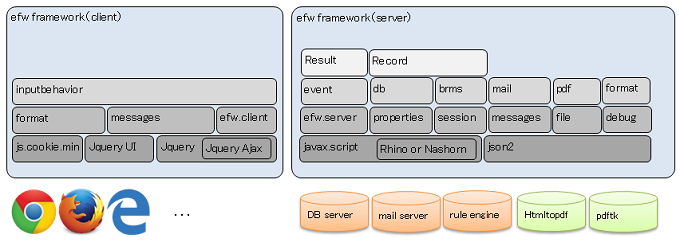

<H1>efw3.X</H1>
<h3>Correlation & Function Diagram</h3>

<h3>Learn</h3>
<a href="help/step_by_step_web.md">Step by Step(Web)</a>, <a href="help/hello_world_web.md">Quick Start(Web)</a>, <a href="help/files_list_web.md">Files List(Web)</a>, <a href="https://efwgrp.github.io/efw3.X/EFW%E7%B4%B9%E4%BB%8Bv1.3%20(Web)/">EFW紹介v1.3</a>, <a href="https://efwgrp.github.io/efw3.X/EFW%E3%83%97%E3%83%AD%E3%82%B0%E3%83%A9%E3%83%9F%E3%83%B3%E3%82%B0v1.3%20(Web)/">EFWプログラミングv1.3</a>
<h3>ToDo</h3>
<a href="help/hello_world_batch.md">Quick Start(Batch TODO)</a>, <a href="help/files_list_batch.md">Files List(Batch TODO)</a>
<H1>API</H1>
<h2>Properties</h2>
<a href="help/properties.web.md">efw.properties</a>, <a href="help/properties.batch.md">batch.properties</a>
<h2>Resources</h2>
<a href="help/resources.context.md">Context XML(TODO)</a>
<h2>JSP</h2>
<table>
<tr><th>Categories</th><th>Items</th></tr>
<tr><td>Base Tags</td><td><a href="help/tag.client.md">Client</a></td><td><a href="help/tag.part.md">Part</a></td></tr>
<tr><td>Additional Tags</td><td><a href="help/tag.elfinder.md">elFinder</a></td><td><a href="help/tag.signature.md">Signature</a></td><td><a href="help/tag.ckeditor.md">CKEditor</a></td><td><a href="help/tag.chart.md">Chart</a></td></tr>
<tr><td>Functions</td><td><a href="help/api_efw_function.md">Efw</a></td></tr>
<tr><td>Attributes</td><td><a href="help/api_data_format.md">data-format</a></td><td><a href="help/api_data_shortcut.md">data-shortcut</a></td></tr>
<tr><td>Barcodes</td><td><a href="help/api_draw_barcode.md">drawServlet</a></td></tr>
</table>
<h2>Outside SQL</h2>
<a href="help/api_sql.md">SQL XML</a>
<h2>Outside Mail</h2>
<a href="help/api_mail.md">Mail XML</a>
<h2>Event JS</h2>
<a href="help/api_event.md">Event Programming</a>, <a href="help/api_global.md">About Global Event</a>
<h3>Global</h3>
<table>
<tr><th>Varieties</th><th>Functions</th></tr>
<tr><td>file</td><td><a href="help/file.get.md">get</a></td><td><a href="help/file.list.md">list</a></td><td><a href="help/file.isFile.md">isFile</a></td><td><a href="help/file.isFolder.md">isFolder</a></td></td><td><a href="help/file.makeFile.md">makeFile</a></td></tr>
<tr><td><td><a href="help/file.exists.md">exists</a></td><td><a href="help/file.duplicate.md">duplicate</a></td><td><a href="help/file.rename.md">rename</a></td><td><a href="help/file.remove.md">remove</a></td><td><a href="help/file.makeDir.md">makeDir</a></td></tr>
<tr><td></td><td><a href="help/file.readAllLines.md">readAllLines</a></td><td><a href="help/file.writeAllLines.md">writeAllLines</a></td><td><a href="help/file.getStorageFolder.md">getStorageFolder</a></td><td><a href="help/file.saveUploadFiles.md">saveUploadFiles</a></td><td><a href="help/file.saveSingleUploadFile.md">saveSingleUploadFile</a></td></tr>
<tr><td></td><td><a href="help/file.getTempFileName.md">getTempFileName</a></td></tr>
<tr><td>absfile</td><td colspan=5>All APIs are the same as the file object, except that the path param is an absolute one.</td></tr>
<tr><td>barcode</td><td><a href="help/barcode.decode.md">decode</a></td></tr>
<tr><td>brms</td><td><a href="help/brms.getRuleById.md">getRuleById</a></td><td><a href="help/brms.getRuleByName.md">getRuleByName</a></td><td><a href="help/brms.getRuleByAlias.md">getRuleByAlias</a></td></tr>
<tr><td>event</td><td><a href="help/event.fire.md">fire</a></td></tr>
<tr><td>db</td><td><a href="help/db.select.md">select</a></td><td><a href="help/db.change.md">change</a></td><td><a href="help/db.master.md">master</a></td></tr>
<tr><td>mail</td><td><a href="help/mail.send.md">send</a></td></tr>
<tr><td>pdf</td><td><a href="help/pdf.create.md">create</a></td><td><a href="help/pdf.merge.md">merge</a></td><td><a href="help/pdf.convert.md"><del>convert</del></a></td></tr>
<tr><td>properties</td><td><a href="help/properties.get.md">get</a></td></tr>
<tr><td>session</td><td><a href="help/session.get.md">get</a></td><td><a href="help/session.set.md">set</a></td><td><a href="help/session.create.md">create</a></td><td><a href="help/session.invalidate.md">invalidate</a></td></tr>
<tr><td>cookie</td><td><a href="help/cookie.get.md">get</a></td><td><a href="help/cookie.set.md">set</a></td></tr>
<tr><td>{ any }</td><td><a href="help/any.debug.md">debug</a></td><td><a href="help/any.format.md">format</a></td><td><a href="help/any.parse.md">parse</a></td></tr>
<tr><td>{ Date }</td><td><a href="help/Date.getYears.md">getYears</a></td></tr>
<tr><td>{ String }</td><td><a href="help/String.base64Encode.md">base64Encode</a></td><td><a href="help/String.base64EncodeURI.md">base64EncodeURI</a></td><td><a href="help/String.base64Decode.md">base64Decode</a></td></tr>
</table>
<h3>Classes</h3>
<table>
<tr><th>Classes</th><th>Functions</th></tr>
<tr><td>Excel</td>
<td><a href="help/excel.new.md">new</a></td>
<td><a href="help/excel.save.md">save</a></td>
<td><a href="help/excel.close.md">close</a></td>
<td><a href="help/excel.getSheetNames.md">getSheetNames</a></td>
</tr>
<tr><td></td>
<td><a href="help/excel.createSheet.md">createSheet</a></td>
<td><a href="help/excel.removeSheet.md">removeSheet</a></td>
<td><a href="help/excel.setSheetOrder.md">setSheetOrder</a></td>
<td><a href="help/excel.setActiveSheet.md">setActiveSheet</a></td>
<td><a href="help/excel.setPrintArea.md">setPrintArea</a></td>
</tr>
<tr><td></td>
<td><a href="help/excel.addRow.md">addRow</a></td>
<td><a href="help/excel.delRow.md">delRow</a></td>
<td><a href="help/excel.showRow.md">showRow</a></td>
<td><a href="help/excel.hideRow.md">hideRow</a></td>
</tr>
<tr><td></td>
<td><a>addCol</a></td>
<td><a>delCol</a></td>
<td><a href="help/excel.showCol.md">showCol</a></td>
<td><a href="help/excel.hideCol.md">hideCol</a></td>
</tr>
<tr><td></td>
<td><a href="help/excel.setCell.md">setCell</a></td>
<td><a href="help/excel.setLink.md">setLink</a></td>
<td><a href="help/excel.showSheet.md">showSheet</a></td>
<td><a href="help/excel.hideSheet.md">hideSheet</a></td>
</tr>
<tr><td></td>
<td><a href="help/excel.getArray.md">getArray</a></td>
<td><a href="help/excel.getSingle.md">getSingle</a></td>
<td><a href="help/excel.getValue.md">getValue</a></td>
<td><a href="help/excel.getMaxRow.md">getMaxRow</a></td>
<td><a>getMaxCol</a></td>
</tr>
<tr><td></td>
<td><a href="help/excel.isEncircled.md">isEncircled</a></td>
<td><a href="help/excel.encircle.md">encircle</a></td>
<td><a href="help/excel.addShape.md">addShape</a></td>
<td><a href="help/excel.addShapeInRange.md">addShapeInRange</a></td>
</tr>
<tr><td>Record</td>
<td><a href="help/record.new.md">new</a></td>
</tr>
<tr><td></td>
<td><a href="help/record.seek.md">seek</a></td>
<td><a href="help/record.sort.md">sort</a></td>
<td><a href="help/record.map.md">map</a></td>
</tr>
<tr><td></td>
<td><a href="help/record.getArray.md">getArray</a></td>
<td><a href="help/record.getSingle.md">getSingle</a></td>
<td><a href="help/record.getValue.md">getValue</a></td>
<td><a href="help/record.length.md">length</a></td>
</tr>
<tr><td>Result</td>
<td><a href="help/result.new.md">new</a></td>
<td><a href="help/result.concat.md">concat</a></td>
</tr>
<tr><td></td>
<td><a href="help/result.runat.md">runat</a></td>
<td><a href="help/result.remove.md">remove</a></td>
<td><a href="help/result.append.md">append</a></td>
<td><a href="help/result.withdata.md">withdata</a></td>
</tr>
<tr><td></td>
<!--<td><a href="help/result.error.md">error</a></td>-->
<td><a href="help/result.show.md">show</a></td>
<td><a href="help/result.hide.md">hide</a></td>
<td><a href="help/result.enable.md">enable</a></td>
<td><a href="help/result.disable.md">disable</a></td>
</tr>
<tr><td></td>
<td><a href="help/result.highlight.md">highlight</a></td>
<td><a href="help/result.attach.md">attach</a></td>
<td><a href="help/result.deleteAfterDownload.md">deleteAfterDownload</a></td>
<td><a href="help/result.saveas.md">saveas</a></td>
</tr>
<tr><td></td>
<td><a href="help/result.confirm.md">confirm</a></td>
<td><a href="help/result.alert.md">alert</a></td>
<td><a href="help/result.focus.md">focus</a></td>
<td><a href="help/result.eval.md">eval</a></td>
<td><a href="help/result.navigate.md">navigate</a></td>
</tr>
<tr><td></td>
</tr>
<tr><td>Batch</td>
<td><a href="help/batch.new.md">new</a></td>
<td><a href="help/batch.concat.md">concat</a></td>
</tr>
<tr><td></td>
<td><a href="help/batch.log.md">log</a></td>
<td><a href="help/batch.echo.md">echo</a></td>
<td><a href="help/batch.exit.md">exit</a></td>
</tr>
</table>
