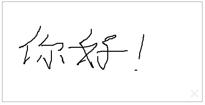
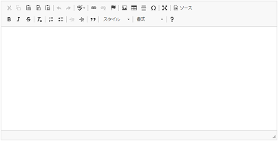

<H1>Efw Tags</H1>

<h2>Client Tag</h2>
To programming with Efw, it is required to import several .js files and .css files into JSP because of JQuery and JQuery UI.
You can use the Efw Tag to make the importing easy.

<pre>
...
&lt;%@ taglib prefix=&quot;efw&quot; uri=&quot;efw&quot; %&gt;
&lt;head&gt;
...
&lt;efw:Client/&gt;		//efw:client or efw:CLIENT
...
&lt;/head&gt;
</pre>
The Client tag will be replaced like the next.

<pre>
&lt;head&gt;
...
&lt;link href=&quot;./efw/efw.css&quot; rel=&quot;stylesheet&quot;&gt;
&lt;link href=&quot;./efw/jquery-ui.min.css&quot; rel=&quot;stylesheet&quot;&gt;
&lt;link href=&quot;./efw/jquery-ui.structure.min.css&quot; rel=&quot;stylesheet&quot;&gt;
&lt;link href=&quot;./efw/jquery-ui.theme.min.css&quot; rel=&quot;stylesheet&quot;&gt;
&lt;script type=&quot;text/javascript&quot; charset=&quot;UTF-8&quot; src=&quot;./efw/jquery-min.js&quot;&gt;&lt;/script&gt;
&lt;script type=&quot;text/javascript&quot; charset=&quot;UTF-8&quot; src=&quot;./efw/jquery-ui.min.js&quot;&gt;&lt;/script&gt;
&lt;script type=&quot;text/javascript&quot; charset=&quot;UTF-8&quot; src=&quot;./efw/js.cookie.min.js&quot;&gt;&lt;/script&gt;
&lt;script type=&quot;text/javascript&quot; charset=&quot;UTF-8&quot; src=&quot;./efw/efw.client.messages.js&quot;&gt;&lt;/script&gt;
&lt;script type=&quot;text/javascript&quot; charset=&quot;UTF-8&quot; src=&quot;./efw/efw.client.format.js&quot;&gt;&lt;/script&gt;
&lt;script type=&quot;text/javascript&quot; charset=&quot;UTF-8&quot; src=&quot;./efw/efw.client.inputbehavior.js&quot;&gt;&lt;/script&gt;
&lt;script type=&quot;text/javascript&quot; charset=&quot;UTF-8&quot; src=&quot;./efw/efw.client.js&quot;&gt;&lt;/script&gt;
&lt;script type=&quot;text/javascript&quot; charset=&quot;UTF-8&quot; src=&quot;./efw/efw.js&quot;&gt;&lt;/script&gt;
...
&lt;/head&gt;
</pre>

<h2>Part Tag</h2>
It will be more easy using Part tag to include a common page part made by JSP in your own JSP.
<pre>
&lt;%@ taglib prefix=&quot;efw&quot; uri=&quot;efw&quot; %&gt;
&lt;body&gt;
...
&lt;efw:Part path="part.jsp" param1="####" param2="####" /&gt;		//or efw:part , efw:PART
...
&lt;/body&gt;
</pre>

You can get the params in the part jsp by request.getAttribute like the next.

<pre>
<%=request.getAttribute("param1")%>
<%=request.getAttribute("param2")%>
</pre>

<H1>Addition Tags</H1>
To use addition tags, the smallist constitution is the next. 
<pre>
    webApp
    ├─yourPage.jsp
    └─WEB-INF
        └─lib
            ├─efw-3.#.###.jar
            ├─efw-addition-tags-3.#.###.jar
            └─juniversalchardet-1.0.3.jar
</pre>

<h2>elFinder Tag</h2>
ElFinder is a famous file manager for web. We made a customized version from <a href="https://studio-42.github.io/elFinder/">elFinder 2.1</a>,
and included it into Efw as a tag. It must be used after the Client tag for jQuery and jQuery UI including. 

<pre>
&lt;%@ taglib prefix=&quot;efw&quot; uri=&quot;efw&quot; %&gt;
&lt;head&gt;
	&lt;efw:Client/&gt;
&lt;/head&gt;
&lt;body&gt;
	&lt;efw:elFinder id="elFinder1" home="homefolder" height="400" width="800" lang="en" readonly="false" /&gt; //or efw:elfinder , efw:Elfinder , efw:ELFINDER
&lt;/body&gt;
</pre>
<h3>Attributes</h3>
<table>
<tr><th>Name</th><th>Required</th><th>Default</th><th>Description</th></tr>
<tr><td>id</td><td>Yes</td><td></td><td>The identity of the elFinder tag. You can use it as the instance of the elFinder.</td></tr>
<tr><td>home</td><td>No</td><td>""</td><td>A relative path to the storage folder(/WEB-INF/storage). You can set <a href="properties_web.md">the properties file</a> to change the storage folder to your own folder.</td></tr>
<tr><td>height</td><td>No</td><td>"400"</td><td>The height of elFinder tag. The unit is "px".</td></tr>
<tr><td>width</td><td>No</td><td>"auto"</td><td>The width of elFinder tag. The unit is "px". </td></tr>
<tr><td>lang</td><td>No</td><td>"en"</td><td>The language of elFinder tag.</td></tr>
<tr><td>readonly</td><td>No</td><td>"false"</td><td>The elFinder tag is for reference or not. </td></tr>
</table>
<h3>Methods</h3>
<table>
<tr><th>Calling</th><th>Returning</th><th>Description</th></tr>
<tr><td>id . setHome ( path )</td><td>void</td><td>To set the home attribute.</td></tr>
<tr><td>id . setHeight ( height ) </td><td>void</td><td>To set the height attribute.</td></tr>
<tr><td>id . setWidth ( width ) </td><td>void</td><td>To set the width attribute.</td></tr>
<tr><td>id . setReadOnly ( readonly ) </td><td>void</td><td>To set the readonly attribute.</td></tr>
</table>

<h2>Signature Tag</h2>
JQuery UI Signature is a famous handwritten sign tool for web.We made a customized version from <a href="http://keith-wood.name/signature.html">jQuery UI Signature 1.1.2</a>,
and included it into Efw as a tag. It must be used after the Client tag for jQuery and jQuery UI including. 

<pre>
&lt;%@ taglib prefix=&quot;efw&quot; uri=&quot;efw&quot; %&gt;
&lt;head&gt;
	&lt;efw:Client/&gt;
&lt;/head&gt;
&lt;body&gt;
	&lt;efw:Signature id="signature1" width="400" height="200" /&gt; //or efw:signature , efw:SIGNATURE 
&lt;/body&gt;
</pre>

<h3>Attributes</h3>
<table>
<tr><th>Name</th><th>Required</th><th>Default</th><th>Description</th></tr>
<tr><td>id</td><td>Yes</td><td></td><td>The identity of the Signature tag. </td></tr>
<tr><td>height</td><td>No</td><td>"200"</td><td>The height of Signature tag. The unit is "px".</td></tr>
<tr><td>width</td><td>No</td><td>"400"</td><td>The width of Signature tag. The unit is "px". </td></tr>
</table>

A hidden input with the id same to the signature tag will be created to contain the image data.
<pre>
	var data = $("#signature1").val();
</pre>

<h2>CKEditor Tag</h2>
CKEditor is a famous rich text editor for web. We made a customized version from <a href="http://ckeditor.com/">CKEditor 4.6.2</a>,
and included it into Efw as a tag. It must be used after the Client tag for jQuery and jQuery UI including. 

<pre>
&lt;%@ taglib prefix=&quot;efw&quot; uri=&quot;efw&quot; %&gt;
&lt;head&gt;
	&lt;efw:Client/&gt;
&lt;/head&gt;
&lt;body&gt;
	&lt;efw:CKEditor id="ckeditor1" width="800" height="300" readonly="false" lang="ja" pattern="standard" /&gt; //or efw:ckeditor , efw:CKeditor , efw:Ckeditor , efw:ckEditor
&lt;/body&gt;
</pre>

<h3>Attributes</h3>
<table>
<tr><th>Name</th><th>Required</th><th>Default</th><th>Description</th></tr>
<tr><td>id</td><td>Yes</td><td></td><td>The identity of the CKEditor tag. </td></tr>
<tr><td>pattern</td><td>No</td><td>"standard"</td><td>The pattern of the CKEditor tag. [ basic | standard | full ]. </td></tr>
<tr><td>height</td><td>No</td><td>"400"</td><td>The height of CKEditor tag. The unit is "px".</td></tr>
<tr><td>width</td><td>No</td><td>"auto"</td><td>The width of CKEditor tag. The unit is "px". </td></tr>
<tr><td>lang</td><td>No</td><td>""</td><td>The language of CKEditor tag. It will detect the language automatically by default.</td></tr>
<tr><td>readonly</td><td>No</td><td>"false"</td><td>The CKEditor tag is for reference or not. </td></tr>
</table>

<h3>Methods</h3>
<table>
<tr><th>Calling</th><th>Returning</th><th>Description</th></tr>
<tr><td>id . setPattern ( path )</td><td>void</td><td>To set the pattern attribute.</td></tr>
<tr><td>id . setHeight ( height ) </td><td>void</td><td>To set the height attribute.</td></tr>
<tr><td>id . setWidth ( width ) </td><td>void</td><td>To set the width attribute.</td></tr>
<tr><td>id . setReadOnly ( readonly ) </td><td>void</td><td>To set the readonly attribute.</td></tr>
</table>

A hidden input with the id same to the CKEditor tag will be created to contain the CKEditor data.
<pre>
	var data = $("#ckeditor1").val();
</pre>

<h2>Chart Tag</h2>
<a href="https://developers.google.com/chart/">Google charts API</a> is a famous html5 chart tool for web. We made several templates to use it more easier,
and included them into Efw as a tag. It must be used after the Client tag for jQuery and jQuery UI including. 

<pre>
&lt;%@ taglib prefix=&quot;efw&quot; uri=&quot;efw&quot; %&gt;
&lt;head&gt;
	&lt;efw:Client/&gt;
&lt;/head&gt;
&lt;body&gt;
	&lt;efw:Chart id="char1" data="chart1_data" type="column" width="400" height="250" /&gt; //or efw:chart , efw:CHART

	&lt;table border=1 id="chart1_data">
	&lt;caption>会社業績&lt;/caption>
		&lt;tr>&lt;th>年度&lt;/th>&lt;th>売上高&lt;/th>&lt;th>営業利益&lt;/th>&lt;th>経常利益&lt;/th>&lt;/tr>
		&lt;tr>&lt;td>2004 年&lt;/td>&lt;td>1000&lt;/td>&lt;td>400&lt;/td>&lt;td>380&lt;/td>&lt;/tr>
	...
	&lt;/table>
&lt;/body&gt;

</pre>

<h3>Attributes</h3>
<table>
<tr><th>Name</th><th>Required</th><th>Default</th><th>Description</th></tr>
<tr><td>id</td><td>Yes</td><td></td><td>The identity of the Chart tag. </td></tr>
<tr><td>data</td><td>Yes</td><td></td><td>The id of a data table to the Chart tag. </td></tr>
<tr><td>type</td><td>Yes</td><td></td><td>The type of the Chart tag. [ column | stackedcolumn | line | pie | donut | bar | stackedbar | area | stackedarea | scatter ]. </td></tr>
<tr><td>height</td><td>No</td><td>"400"</td><td>The height of Chart tag. The unit is "px".</td></tr>
<tr><td>width</td><td>No</td><td>"auto"</td><td>The width of Chart tag. The unit is "px". </td></tr>
</table>

<h3>Methods</h3>
<table>
<tr><th>Calling</th><th>Returning</th><th>Description</th></tr>
<tr><td>id . draw ( )</td><td>void</td><td>To draw the chart again.</td></tr>
<tr><td>id . setType ( type )</td><td>void</td><td>To set the type attribute.</td></tr>
<tr><td>id . setHeight ( height ) </td><td>void</td><td>To set the height attribute.</td></tr>
<tr><td>id . setWidth ( width ) </td><td>void</td><td>To set the width attribute.</td></tr>
</table>